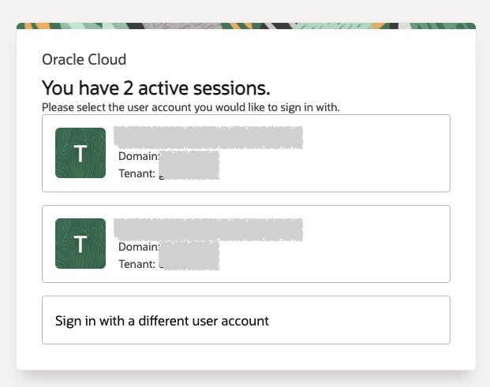
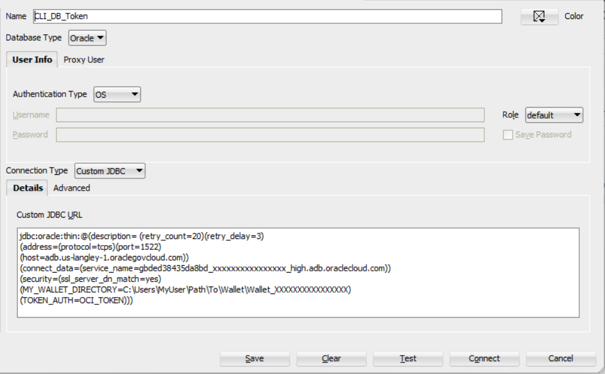
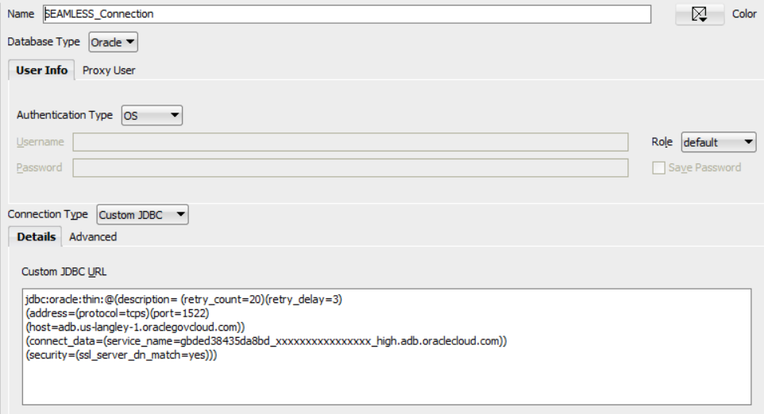
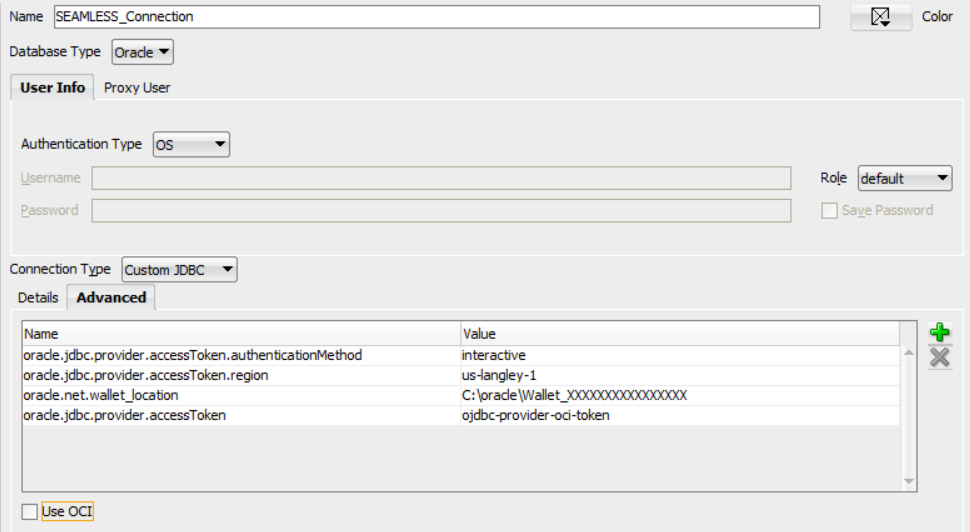
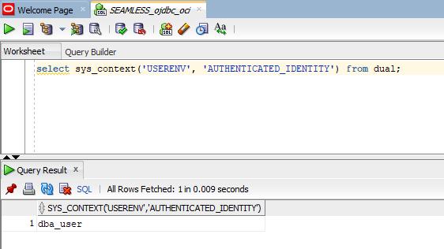

# oci-iam-sso

- [IAM Authentication with Autonomous Database: Documentation](https://docs.oracle.com/en-us/iaas/autonomous-database-serverless/doc/manage-users-iam.html)
- [IAM Authentication with Autonomous Database: Video Series](https://www.youtube.com/playlist?list=PLdtXkK5KBY5600tYKz2ZJFMGyqn6wWeK0)

# Using the OCI CLI for SSO DB Token Authentication

## Initial Setup - Create OCI Config File
For this guide, we want to use session tokens intead of API keys to ensure all access is ephemeral and nothing is stored permanently on the client. We are using the OCI CLI to grab the session and db_tokens used to authenticate to the database. Typically, the `oci setup config` command is used to create an intial OCI config. However, that process expects an API key - Which we won't have.

Instead, we will create a config file at `~/.oci/config` and populate it with the following information:
[Example Intial Configuration](example-config-initial)

Modify the lines (tenancy, region, security_token_file) with your own tenancy OCID, the region you are using, and the path where you would like your security token file to be stored.

## Retrieve the initial Session Token

We will utilize the OCI CLI `oci session authenticate` command to populate the initial session token file. On subsequent calls, we will use the `oci iam db-token get --auth security_token` command to refresh our session token (If expired) and grab our db_token.

1. Execute the following command to retrieve the inital session token. The token will be stored at the location specified by `security_token_file` in the OCI config. Optionally, connect to a specific region using the `--region` parameter

```
oci session authenticate [OPTIONAL --region us-langley-1]
```

2. Upon execution, a browser window will appear that will request your user's OCI IAM credentials. Enter your credentials. 



If successful, you will see the following message in the browser.


3. Back in the shell where you executed the `oci session authenticate` command, you will be asked to `Enter the name of the profile you would like to create:`. Enter `DEFAULT` (case-sensitive) to save the information against your `DEFAULT` OCI Config profile.

4. You can verify the session token was successfully retrived by inspecting the file downloaded to the `security_token_file` path set in the OCI Config

## Retrieve the OCI IAM DB Token

Now that we have the session token, we can utilize it to authenticate and retrive our db token

1. Execute the following command to retrieve the db token

```
oci iam db-token get --auth security_token [OPTIONAL --region us-langley-1]
```

One benefit of using the `--auth security_token` option is that if your session token is expired, a prompt will appear stating:

```
ERROR: This CLI session has expired, so it cannot currently be used to run commands
Do you want to re-authenticate your CLI session profile? [Y/n]
```

Entering `Y` will enter the re-authentication process. Note that you must still run the `db-token get` command again once a new session token is retrieved to grab a db token.

2. Upon successful execution, the token will be stored by default at `~/.oci/db-token/token`

# Connecting to ADB-S using SQL*PLus and DB Token
This section will describe how to utilize OCI IAM session tokens to authenticate to an OCI hosted Autonomous Database (ADB-S) using Single Sign On (SSO).

## Architecture
<Insert Architecture here>

## Prerequisites
1. [OCI CLI](https://docs.oracle.com/en-us/iaas/Content/API/SDKDocs/cliinstall.htm)
1. [SQL*Plus](https://www.oracle.com/database/technologies/instant-client.html)

## Configure connection using Wallet
We are using the ADB [wallet](https://docs.oracle.com/en/cloud/paas/autonomous-database/serverless/adbsb/connect-download-wallet.html) to create a connection to our database. After downloading the wallet, copy the `sqlnet.ora` and `tnsnames.ora` file to your SQLPlus Instant Client directory at (ORACLE_HOME/network/admin)

The connection string needs to be modified to include the (TOKEN_AUTH=OCI_TOKEN) parameter:

```
xxxxxxxxxxxxxxxx_high = (description= (retry_count=20)(retry_delay=3)(address=(protocol=tcps)(port=1522)(host=adb.us-langley-1.oraclegovcloud.com))(connect_data=(service_name=gbded38435da8bd_xxxxxxxxxxxxxxxx_high.adb.oraclecloud.com))(security=(ssl_server_cert_dn="CN=adb.us-langley-1.oraclegovcloud.com,O=Oracle Corporation,L=Redwood City,ST=California,C=US")(TOKEN_AUTH=OCI_TOKEN)))
```

## Connect using SQL*Plus

1. Using the OCI CLI, retrieve a db token using the steps shown above
1. Connect to the database using the service connection

```
sqlplus /@xxxxxxxxxxxxxxxx_high
```

# Connecting to ADB-S using SQLDeveloper and DB Token

## Prerequisites
1. [OCI CLI](https://docs.oracle.com/en-us/iaas/Content/API/SDKDocs/cliinstall.htm)
1. [SQL Developer](https://www.oracle.com/database/sqldeveloper/technologies/download/)

## Configure connection using Wallet

We are using the ADB [wallet](https://docs.oracle.com/en/cloud/paas/autonomous-database/serverless/adbsb/connect-download-wallet.html) to create a connection to our database. Create a new connection in SQLDeveloepr and configure the service_name and wallet directory for your particular values.



## Connect using SQLDeveloper

1. Using the OCI CLI, retrieve a db token using the steps shown above
1. Connect to the database by double clicking your connection

# Connecting to ADB-S using SQLDeveloper via ojdbc-provider-oci jars
Unlike the previous two methods, this login process utilizes the Oracle JDBC OCI Provider to provide seamless authentication to the database - without the manual use of the OCI CLI to pull a database token. Though this process, a user attempting a connection using SQLDeveloper will be prompted to authenticate via a browser.    After successful authentication, the user will have instant access to a connected SQL Window.

## Prerequisites
1. [SQL Developer](https://www.oracle.com/database/sqldeveloper/technologies/download/)
1. [Apache Maven](https://maven.apache.org/)

## Setup the ojdbc-extensions
The Oracle JDBC Driver extensions extend the Oracle JDBC Driver for integration with cloud services and other specialized APIs. Specifically, for us we will be using the Oracle JDBC OCI Provider to interact with Oracle Cloud Infrastructure (OCI).

The first step is building the [JDBC extensions](https://github.com/oracle/ojdbc-extensions) from the Oracle public github repository.  You can either clone this repository using [git](https://git-scm.com/) or simply just download the entire bundle.

You will also need to have [Apache Maven](https://maven.apache.org/) installed which is an open source build utility. This utility is responsible for building, retrieving dependencies, and installing the libraries into your local maven repository.

The commands below will create the git repo and pull the required jars from Maven Central. We will then move the oci provider and dependant jars into a single folder to make them easier for SQLDeveloper to include in a later step.

```bash
## Clone the git repo and pull the dependencies
git clone https://github.com/oracle/ojdbc-extensions.git
cd ojdbc-extensions/ojdbc-provider-oci
mvn package dependency:copy-dependencies -DskipTests

## Move the necessary jars into a single location
mkdir $HOME/ojdbc-provider-oci-jars
cp target/*.jar $HOME/ojdbc-provider-oci-jars 
cp target/dependency/*.jar $HOME/ojdbc-provider-oci-jars
```
If the commands above executed successfully, the ojdbc provider jars will be staged in a folder at:
```bash
## Staged Location
C:\Users\<Username>\ojdbc-provider-oci-jars
```

## Update the SQLDeveloper configuration file
Now that you have all of the libraries that are needed for the SQLDeveloper runtime, we will be updating the SQLDeveloper configuration to load those newly acquired libraries into runtime at the next startup of the application.

For a Windows setup, the default configuration is in the following location:
```
C:\Users\<Username>\AppData\Roaming\sqldeveloper\<version>\product.conf
```
For each of the jars in the staged location shown above, copy them into the `product.conf` file as follows:

```
AddJavaLibFile C:\Users\<Username>\ojdbc-provider-oci-jars\aopalliance-repackaged-2.6.1.jar
AddJavaLibFile C:\Users\<Username>\ojdbc-provider-oci-jars\apiguardian-api-1.1.2.jar
AddJavaLibFile C:\Users\<Username>\ojdbc-provider-oci-jars\bcpkix-jdk15to18-1.78.1.jar
AddJavaLibFile C:\Users\<Username>\ojdbc-provider-oci-jars\bcprov-jdk15to18-1.78.1.jar
AddJavaLibFile C:\Users\<Username>\ojdbc-provider-oci-jars\bcutil-jdk15to18-1.78.1.jar
... continued
```
An example `product.conf` file can be accessed [here](example-product.conf)

If SQLDeveloper is already open, be sure to restart the application to load the jars from the modified config file.

## Setup the SQLDeveloper Connection
We will now create a new connection in SQLDeveloper as shown below:



In the properties, I have added the Advanced properties to instruct the JDBC driver to trigger the OCI IAM Interactive Authentication flow by setting the following values:

| Name      | Value |
| ----------- | ----------- |
| oracle.jdbc.provider.accessToken.authenticationMethod      | interactive       |
| oracle.jdbc.provider.accessToken.region | us-langley-1        |
| oracle.net.wallet_location | C:\oracle\Wallet_XXXXXXXXXXXXXXXX |
| oracle.jdbc.provider.accessToken | ojdbc-provider-oci-token |
| oracle.jdbc.provider.accessToken.scope   | urn:oracle:db::id::ocid1.compartment.oc1..aaaaaaaaaaaaaaaaaaaaaaaaaaaaaaaaaaaaaaaaaaaaaaaaaaaaaaaaaaaa::ocid1.autonomousdatabase.oc1.phx.xxxxxxxxxxxxxxxxxxxxxxxxxxxxxxxxxxxxxxxxxxxxxxxxxxxxxxxxxxxx  |

*Note that the `region` parameter is only needed if connecting to  non-commerical OCI region. Additionally, if the policy associated with the usr is set at the tenancy level, the `scope` parameter is not required*



## Test the Connection and Authenticate
Upon selecting either the `Test` or `Connect` button - this should trigger a browser to open on your desktop.  Then, you will be sent to the Oracle Cloud Infrastructure web-based login.  Now, all you need to do is authenticate to the correct OCI tenancy and Identity Domain that has been configured as the Identity Provider of the database


If everything worked properly, then you then will be presented a blank SQL Worksheet where you can start to execute statements.  Here I am showing that my user is set to the Globally Identified Schema User, and that the enterprise authentication that is tied to this session is the user principal that I used to authenticate to OCI IAM Domain.



