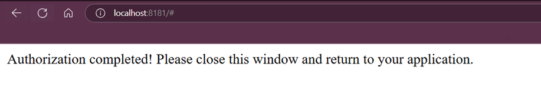

# oci-iam-sso

- [IAM Authentication with Autonomous Database: Documentation](https://docs.oracle.com/en-us/iaas/autonomous-database-serverless/doc/manage-users-iam.html)
- [IAM Authentication with Autonomous Database: Video Series](https://www.youtube.com/playlist?list=PLdtXkK5KBY5600tYKz2ZJFMGyqn6wWeK0)

## Initial Setup - Create OCI Config File
For this guide, we want to use session tokens intead of API keys to ensure all access is ephemeral and nothing is stored permanently on the client. We are using the OCI CLI to grab the session and db_tokens used to authenticate to the database. Typically, the `oci setup config` command is used to create an intial OCI config. However, that process expects an API key - Which we won't have.

Instead, we will create a config file at `~/.oci/config` and populate it with the following information:
[Example Intial Configuration](example-config-initial)

Modify the lines (tenancy, region, security_token_file) with your own tenancy OCID, the region you are using, and the path where you would like your security token file to be stored.

## Retrieve the initial Session Token

We will utilize the OCI CLI `oci session authenticate` command to populate the initial session token file. On subsequent calls, we will use the `oci iam db-token get --auth security_token` command to refresh our session token (If expired) and grab our db_token.

1. Execute the following command to retrieve the inital session token. The token will be stored at the location specified by `security_token_file` in the OCI config. Optionally, connect to a specific region using the `--region` parameter

```
oci session authenticate [OPTIONAL --region us-langley-1]
```

2. Upon execution, a browser window will appear that will request your user's OCI IAM credentials. Enter your credentials. If successful, you will see the following message in the browser.



3. Back in the shell where you executed the `oci session authenticate` command, you will be asked to `Enter the name of the profile you would like to create:`. Enter `DEFAULT` (case-sensitive) to save the information against your `DEFAULT` OCI Config profile.

4. You can verify the session token was successfully retrived by inspecting the file downloaded to the `security_token_file` path set in the OCI Config

## Retrieve the OCI IAM DB Token

Now that we have the session token, we can utilize it to authenticate and retrive our db token

1. Execute the following command to retrieve the db token

```
oci iam db-token get --auth security_token [OPTIONAL --region us-langley-1]
```

One benefit of using the `--auth security_token` option is that if your session token is expired, a prompt will appear stating:

```
ERROR: This CLI session has expired, so it cannot currently be used to run commands
Do you want to re-authenticate your CLI session profile? [Y/n]
```

Entering `Y` will enter the re-authentication process. Note that you must still run the `db-token get` command again once a new session token is retrieved to grab a db token.

2. Upon successful execution, the token will be stored by default at `~/.oci/db-token/token`